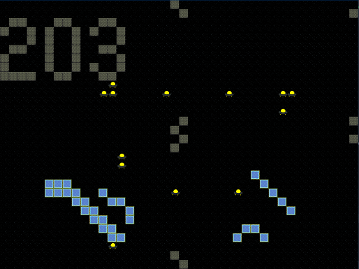

Rocket vs UFO
=============

Rocket Vs UFO is game built using java, that demonstrates inheritance, interfaces, and abstract classes.

Controls
--------

Click anywhere on board to spawn the rocket
Use the arrow keys to dodge UFOs and collect stars
Note that the edges of the board wrap around
